# AWS VPC Gateway Endpoint for S3 — Private S3 Access Without Internet
<div align="center">


# 🔐 VPC Gateway Endpoint for S3 — Private Access Without Internet

[](https://aws.amazon.com/s3/)
[](#)
[](#)
[](#)

> **Give EC2 instances in private subnets direct, private access to Amazon S3 — no NAT Gateway, no Internet Gateway, and no public IPs. All traffic stays on AWS's internal backbone, and it's completely free!**

[](#)
[-blue?style=flat-square)](#)
[](#)

</div>

---


```mermaid
flowchart TB
    User["🖥️ Your Laptop 🌐"] -->|"🔐 SSH via public IP"| IGW["🌍 Internet Gateway<br/>🟢 Public"]

    IGW --> EC2A["🟢 EC2-A Bastion<br/>Public Subnet<br/>10.100.0.x"]

    subgraph VPC ["🌐 VPC-A · ap-south-1 (10.100.0.0/16)"]
        subgraph Public ["🔓 Public Subnet 10.100.0.0/24"]
            EC2A
        end
        subgraph Private ["🔒 Private Subnet 10.100.11.0/24"]
            EC2B["📦 EC2-B<br/>Private IP only<br/>🛡️ IAM: S3ReadOnly"]
        end
        RT_Private["📋 Private Route Table<br/>✨ 10.100.0.0/16 → local<br/>✨ pl-xxxx (S3 prefix) → vpce-xxxx"]
        GWEP["🔗 VPC Gateway Endpoint<br/>com.amazonaws.ap-south-1.s3<br/>🚀 Free"]
    end

    EC2A -->|"🚪 SSH hop"| EC2B
    EC2B -->|"⬇️ S3 request"| RT_Private
    RT_Private -.->|"✅ Prefix list match"| GWEP
    GWEP -->|"⚡ AWS internal backbone<br/>━━━━━━━━━━━━━➡️"| S3["🗄️ Amazon S3<br/>📍 same region bucket<br/>✅ Success!"]

    style User fill:#aaffff,stroke:#0066cc,stroke-width:2px,color:#000
    style IGW fill:#0a1a2a,stroke:#0ff,stroke-width:2px
    style EC2A fill:#1e5775,stroke:#0ff,stroke-width:2px
    style EC2B fill:#1e4a6e,stroke:#f76,stroke-width:2px
    style RT_Private fill:#0b2b3b,stroke:#f1c40f,stroke-width:2px,stroke-dasharray:5 3
    style GWEP fill:#0f172a,stroke:#0ff,stroke-width:3px
    style S3 fill:#1b4d2e,stroke:#2ecc71,stroke-width:3px
    style VPC fill:#102033,stroke:#28e1ff,stroke-width:2px
    style Public fill:#10314b,stroke:#2dd4bf,stroke-width:1px
    style Private fill:#0f2a3a,stroke:#f76,stroke-width:1px
```

## Architecture Overview

```
Your Laptop
    │  SSH (public internet)
    ▼
Internet Gateway (IGW)
    │
    ▼  ┌─────────────────────────────── AWS Region: ap-south-1 ────────────────────────--┐
       │                                                                                 │
       │  VPC-A  (10.100.0.0/16)                                                         │
       │  ┌──────────────────────────────────────--┐                                     │
       │  │  Public Subnet  10.100.0.0/24          │                                     │
       │  │  ┌──────────────────────────────────┐  │                                     │
       │  │  │  EC2-A  │  Public + Private IP   │  │                                     │
       │  │  │  (Bastion host)                  │  │                                     │
       │  │  └──────────────────────────────────┘  │                                     │
       │  │            │ SSH                       │                                     │
       │  │  Private Subnet  10.100.11.0/24        │                                     │
       │  │  ┌──────────────────────────────────┐  │                                     │
       │  │  │  EC2-B  │  Private IP only       │  │                                     │
       │  │  │  IAM Role: S3ReadOnly attached   │──┼──► VPC Gateway Endpoint ──► Amazon S3
       │  │  └──────────────────────────────────┘  │    (no internet, AWS backbone)      │
       │  └──────────────────────────────────────--┘                                     │
       │                                                                                 │
       └────────────────────────────────────────────────────────────────────────────────-┘
```

**Goal:** Allow EC2-B (private subnet, no internet access) to download files from Amazon S3 — WITHOUT a NAT Gateway, internet gateway route, or public internet exposure.

**The secret:** A **VPC Gateway Endpoint** creates a route inside your VPC that lets traffic reach S3 via AWS's internal backbone network.

---

## Why Is This Needed?

| Scenario | EC2-B → S3 | Why |
|----------|-----------|-----|
| Private subnet, no endpoint | ❌ FAILS | S3's public endpoint is unreachable; private subnet has no `0.0.0.0/0` route |
| Private subnet + NAT Gateway | ✅ Works | But expensive (~$0.045/hr + data transfer cost) and uses internet |
| Private subnet + VPC Gateway Endpoint | ✅ Works | Free! Traffic never leaves AWS network. Secure and fast. |

---

## Step 1 — Create VPC and Subnets

### Create VPC-A
1. Go to **AWS Console → VPC → Your VPCs → Create VPC**
2. Region: `ap-south-1` (Mumbai — or any region you prefer)
3. Name: `VPC-A`
4. IPv4 CIDR: `10.100.0.0/16`

### Create and attach Internet Gateway
1. **VPC → Internet Gateways → Create internet gateway**
2. Name: `VPC-A-IGW`
3. **Actions → Attach to VPC** → select `VPC-A`

### Create Public Subnet
| Field | Value |
|-------|-------|
| Name | `VPC-A-Public-Subnet` |
| VPC | `VPC-A` |
| AZ | `ap-south-1a` |
| CIDR | `10.100.0.0/24` |

Create route table `VPC-A-Public-RT`:
- Add route: `0.0.0.0/0` → `VPC-A-IGW`
- Associate with `VPC-A-Public-Subnet`

### Create Private Subnet
| Field | Value |
|-------|-------|
| Name | `VPC-A-Private-Subnet` |
| VPC | `VPC-A` |
| AZ | `ap-south-1a` |
| CIDR | `10.100.11.0/24` |

Create route table `VPC-A-Private-RT`:
- Default only: `10.100.0.0/16` → `local`
- **No internet route** — this is intentional
- Associate with `VPC-A-Private-Subnet`

> **Key design decision:** The private subnet deliberately has no internet route. This is what we're solving with the Gateway Endpoint.

---

## Step 2 — Launch EC2 Instances

### EC2-A (Public Subnet — Bastion)
1. Launch in `ap-south-1a`, `VPC-A-Public-Subnet`
2. **Enable** Auto-assign Public IP
3. Security Group `EC2-A-SG`:
   - SSH (22) inbound from `My IP` or `0.0.0.0/0`
4. Key pair: `my-key.pem`

### EC2-B (Private Subnet)
1. Launch in `ap-south-1a`, `VPC-A-Private-Subnet`
2. **Disable** Auto-assign Public IP
3. Security Group `EC2-B-SG`:
   - SSH (22) inbound from `10.100.0.0/16` (VPC CIDR)
4. Same key pair: `my-key.pem`
5. **No IAM role yet** — we'll add it in the next step

---

## Step 3 — Create S3 Bucket and Upload a File

```
S3 Console → Create bucket
```

| Field | Value |
|-------|-------|
| Bucket name | `my-vpc-endpoint-test-<your-name>` (must be globally unique) |
| AWS Region | `ap-south-1` (same region as your VPC!) |
| Block all public access | ✅ Enabled (default) |

After creating the bucket:
1. Select the bucket → **Upload → Add files**
2. Choose any small test file (e.g., `test.txt`)
3. Click **Upload**

> **Important:** The bucket must be in the **same region** as your VPC. Gateway Endpoints are region-specific.

---

## Step 4 — Create IAM Role for EC2-B

EC2-B needs permission to read from S3. We do this via an IAM Role (not access keys).

### Create the IAM role
1. **IAM Console → Roles → Create role**
2. Trusted entity type: **AWS service**
3. Use case: **EC2**
4. Click **Next → Permission policies**
5. Search for `AmazonS3ReadOnlyAccess` → select it
6. Role name: `EC2_ROLE_FOR_S3_READONLY`
7. **Create role**

### Attach role to EC2-B
1. Go to **EC2 Console → Instances → select EC2-B**
2. **Actions → Security → Modify IAM role**
3. Select `EC2_ROLE_FOR_S3_READONLY`
4. **Update IAM role**

> **Why a role and not access keys?** IAM roles are best practice. The role is attached to the instance, credentials rotate automatically, and you never store keys on the server.

---

## Step 5 — Test S3 Access (Should Fail)

### SSH chain to EC2-B
```bash
# From your laptop
ssh -i my-key.pem ec2-user@<EC2-A-Public-IP>

# From EC2-A, copy key and SSH to EC2-B
scp -i my-key.pem my-key.pem ec2-user@<EC2-A-Public-IP>:~/.ssh/
# Then:
ssh -i ~/.ssh/my-key.pem ec2-user@10.100.11.<x>
```

### Try to download from S3
```bash
# From EC2-B terminal
aws s3 cp s3://my-vpc-endpoint-test-<your-name>/test.txt /home/ec2-user/

# Expected result:
# fatal error: An error occurred (RequestError) when calling
# the GetObject operation: Send request failed: ...
# OR: hangs with no response
```

**Why does this fail?**
- EC2-B is in the private subnet
- Private subnet route table has only: `10.100.0.0/16 → local`
- S3's endpoint is on the public internet (`s3.ap-south-1.amazonaws.com`)
- There is no route to reach the internet from this subnet
- → **No route to host** — packet is dropped

---

## Step 6 — Create VPC Gateway Endpoint for S3

### 6a. Open VPC Endpoints
1. Go to **VPC Console → Endpoints → Create endpoint**

### 6b. Configure the endpoint
| Field | Value |
|-------|-------|
| Name tag | `my-s3-gateway-endpoint` |
| Service category | AWS services |
| Service name | `com.amazonaws.ap-south-1.s3` |
| Type | **Gateway** |
| VPC | `VPC-A` |
| Route tables | Select `VPC-A-Private-RT` ← Critical! |

Click **Create endpoint**

### 6c. Verify the route table was updated
1. Go to **VPC → Route Tables → VPC-A-Private-RT**
2. Check the **Routes** tab:

| Destination | Target |
|-------------|--------|
| `10.100.0.0/16` | local |
| `pl-xxxxxxxx` (S3 prefix list) | `vpce-xxxxxxxxxxxxxxxxx` |

AWS automatically adds this route! The `pl-xxxxxxxx` is a **managed prefix list** — AWS maintains the list of all S3 IP ranges in your region, so you never need to update the route manually.

> **Gateway vs Interface Endpoint**
>
> | Feature | Gateway Endpoint | Interface Endpoint |
> |---------|-----------------|-------------------|
> | Supported services | S3, DynamoDB only | Most AWS services |
> | Routing mechanism | Route table entry | Private IP (ENI) |
> | Cost | **Free** | ~$0.01/hr per AZ + data |
> | Internet traffic | None | None |
> | DNS change needed | No | Yes (optional) |

---

## Step 7 — Verify S3 Access (Should Work Now)

```bash
# From EC2-B terminal (same SSH session or re-SSH)
aws s3 cp s3://my-vpc-endpoint-test-<your-name>/test.txt /home/ec2-user/

# Expected result:
# download: s3://my-vpc-endpoint-test-.../test.txt to ./test.txt

# Verify the file downloaded
cat /home/ec2-user/test.txt

# Also try listing the bucket
aws s3 ls s3://my-vpc-endpoint-test-<your-name>/
```

### What changed?
- The private subnet route table now has `pl-xxxxxx → vpce-xxxxxx`
- When EC2-B sends a packet to S3's IP, the route table matches the prefix list
- Traffic is redirected to the VPC Gateway Endpoint
- The packet travels over **AWS's internal network** — never the public internet
- S3 receives the request and authenticates via the IAM role

---

## Traffic Path (Before vs After)

### Before Gateway Endpoint
```
EC2-B → Private Route Table → No matching route for S3 IPs → DROPPED ✕
```

### After Gateway Endpoint
```
EC2-B
  → Private Route Table (matches pl-xxxxxx S3 prefix list)
  → VPC Gateway Endpoint (vpce-xxxxxx)
  → AWS Internal Network (no internet involved)
  → Amazon S3 (same region)
  → Response follows same path back
  → EC2-B ✅
```

---

## Security Best Practices

### Endpoint policy (restrict which S3 buckets are accessible)

By default the Gateway Endpoint allows access to ALL S3 buckets. You can restrict it:

1. Go to **VPC → Endpoints → select your endpoint**
2. **Policy tab → Edit policy**
3. Replace with a custom policy:

```json
{
  "Version": "2012-10-17",
  "Statement": [
    {
      "Principal": "*",
      "Action": ["s3:GetObject", "s3:ListBucket"],
      "Effect": "Allow",
      "Resource": [
        "arn:aws:s3:::my-vpc-endpoint-test-<your-name>",
        "arn:aws:s3:::my-vpc-endpoint-test-<your-name>/*"
      ]
    }
  ]
}
```

### S3 bucket policy (restrict access only from your VPC)

Add to your S3 bucket policy to deny access from outside the VPC:

```json
{
  "Version": "2012-10-17",
  "Statement": [
    {
      "Sid": "DenyNonVPCAccess",
      "Effect": "Deny",
      "Principal": "*",
      "Action": "s3:*",
      "Resource": [
        "arn:aws:s3:::my-vpc-endpoint-test-<your-name>",
        "arn:aws:s3:::my-vpc-endpoint-test-<your-name>/*"
      ],
      "Condition": {
        "StringNotEquals": {
          "aws:sourceVpce": "vpce-xxxxxxxxxxxxxxxxx"
        }
      }
    }
  ]
}
```

---

## Troubleshooting

**`aws s3 cp` still failing after creating endpoint?**
- Confirm the route table selected during endpoint creation was `VPC-A-Private-RT` (not the public RT)
- Verify the route `pl-xxxxxx → vpce-xxxxxx` appears in the private route table
- Confirm the IAM role `EC2_ROLE_FOR_S3_READONLY` is attached to EC2-B
- Run `aws sts get-caller-identity` on EC2-B — if it returns a role ARN, IAM is working

**IAM credentials not found?**
```bash
# Check what identity EC2-B is using
aws sts get-caller-identity
# Should return the EC2 role ARN — if it shows "Unable to locate credentials", the IAM role is not attached
```

**Wrong region?**
```bash
# Check EC2-B's region config
aws configure list
# The region should match your bucket's region (ap-south-1)
# If not: aws configure set region ap-south-1
```

**Endpoint in wrong region?**
- Gateway Endpoints are region-specific. You cannot use an endpoint in ap-south-1 to reach a bucket in us-east-1.

---

## Clean-Up

### If not continuing to next exercises
1. Terminate both EC2 instances
2. **VPC → Endpoints → select endpoint → Actions → Delete endpoint**
3. Delete VPC-A (this also removes subnets, route tables if empty)
4. Delete S3 bucket (empty it first, then delete)

### If continuing to next exercises
1. **Delete the VPC Gateway Endpoint** (removes the S3 route from private RT)
2. Update `VPC-A-Private-RT` — manually remove the `pl-xxxxxx → vpce-xxxxxx` entry if still there
3. Keep VPC-A, subnets, and EC2 instances for the next exercise

> **Cost reminder:** VPC Gateway Endpoints for S3 are completely free. No hourly charge, no per-GB charge. You only pay for the EC2 instances and any S3 storage/requests.

---

## Key Concepts Recap

| Concept | Explanation |
|---------|-------------|
| **VPC Gateway Endpoint** | A VPC resource that lets private subnets reach S3 or DynamoDB without internet |
| **Prefix list** (`pl-xxxxxx`) | AWS-managed list of S3 IP ranges for your region (auto-updated by AWS) |
| **Route table target** (`vpce-xxxxxx`) | The endpoint itself becomes the next-hop for matched S3 traffic |
| **No internet route needed** | Private subnet stays private; no NAT Gateway required for S3 |
| **IAM Role on EC2** | Grants the instance permission to call AWS APIs (S3 in this case) |
| **Region-scoped** | Endpoint in ap-south-1 only routes to S3 in ap-south-1 |
| **Free service** | Unlike Interface Endpoints, Gateway Endpoints have zero hourly cost |
